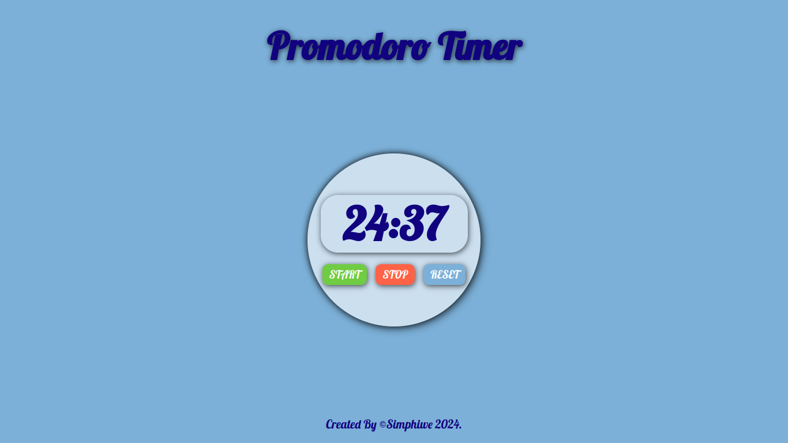

# **Promodoro Timer**

A simple Pomodoro timer application to help you stay focused and productive.

## Features

- Pause, resume, and reset functionality

## Usage

1. Start the timer by clicking the "Start" button.
2. Pause or resume the timer as needed.
3. Reset the timer to its default settings.

## Screenshots

## Tech stack

- HTML
- CSS
- JavaScript

## Contact

For questions or feedback, please email:
**simphiwedladla8@gmail.com**

Check it _**LIVE**_ on the below link:
**<https://deebest.github.io/promodoro-timer/>**
